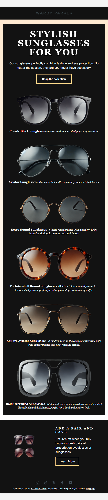

# WarbyParker: Адаптивный шаблон email с поддержкой темной темы

## Описание

Данный проект представляет собой адаптивный шаблон письма, включающий поддержку как светлой, так и темной тем. Письмо разработано с учетом адаптивности, что обеспечивает правильное отображение на различных устройствах, включая мобильные телефоны. Шаблон поддерживает все основные почтовые клиенты, такие как Outlook, Gmail и Apple Mail.

## Основные функции

- **Адаптивный дизайн**: Письмо полностью адаптивно и корректно отображается на экранах различных размеров, включая мобильные устройства.
- **Поддержка темной темы**: При включении темной темы в настройках устройства письмо автоматически переключается на темный фон и светлый текст.
- **Совместимость с почтовыми клиентами**: Корректная обработка элементов для таких клиентов, как Outlook, с использованием фантомных таблиц.

## Использованные технологии

- **HTML**
- **CSS**
- **Фантомные таблицы для поддержки Outlook**
- **Адаптивная верстка с использованием медиа-запросов**

## Поддержка темной темы

Шаблон письма поддерживает темную тему с помощью медиазапроса `prefers-color-scheme`. При включении темной темы на устройстве пользователя письмо автоматически адаптируется, переключая фон на темный и текст на светлый для лучшей читабельности.

## Скриншоты

  
  
  

